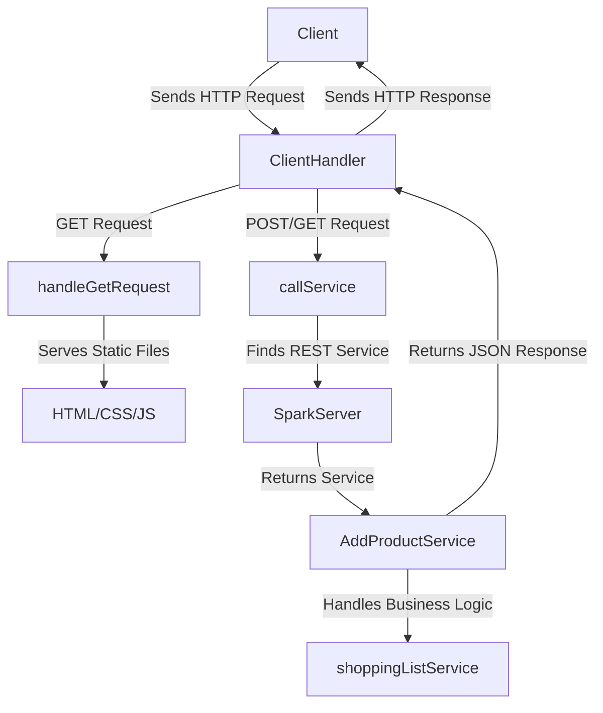

# DESARROLLO DE FRAMEWORK WEB PARA SERVICIOS REST Y GESTIÓN DE ARCHIVOS ESTÁTICOS

Este proyecto implementa una aplicación web de lista de compras (Shopping List) que permite agregar, ver y eliminar productos. La aplicación está desarrollada en Java, utilizando únicamente las bibliotecas estándar de red de Java, simulando el uso del framework Spark.

## Comenzando

Las siguientes instrucciones le permitirán obtener una copia del proyecto en funcionamiento en su máquina local para fines de desarrollo y prueba.

### Construido con:
    
* [Git](https://git-scm.com) - Control de versiones
* [Maven](https://maven.apache.org) -  Manejador de dependencias
* [java](https://www.oracle.com/java/technologies/downloads/#java21) - Lenguaje de programación

### Requisitos:

#### ⚠️ Importante

Es necesario tener instalado Git, Maven y Java 21 para poder ejecutar el proyecto.

## Arquitectura de la Aplicación
### Cliente Servidor


### Descripción del Diagrama:

- **Client**: El cliente (navegador o cliente HTTP) envía una solicitud HTTP al servidor.
- **ClientHandler**: La clase principal que maneja la solicitud. Determina si la solicitud es GET para servir archivos estáticos o POST/GET para un servicio REST.
- **HandleGetRequest**: Maneja las solicitudes GET que no están relacionadas con servicios REST y sirve los archivos estáticos (HTML, CSS, JS).
- **CallService**: Invoca el servicio REST adecuado basado en la URI y el método HTTP.
- **SparkServer**: Contiene las rutas registradas y sus servicios REST asociados. Encuentra el servicio correcto para la ruta solicitada.
- **AddProductService**: Un ejemplo de servicio REST que maneja la lógica de agregar productos al carrito de compras.
- **ShoppingListService**: El servicio de negocio que realiza las operaciones sobre la lista de productos.
- **Response**: Después de manejar la solicitud, el servidor envía una respuesta HTTP de vuelta al cliente, que puede ser un archivo estático o un JSON con la respuesta del servicio REST.

## Estructura del Proyecto

- **src/main/java/edu/eci/arep**: Contiene el código fuente principal del servidor HTTP y los servicios REST.
    - **ClientHandler.java**: Maneja las solicitudes entrantes y las direcciona al servicio correspondiente.
    - **SparkServer.java**: Registra y gestiona los servicios REST.
    - **services**: Directorio que contiene las implementaciones de los servicios REST.
        - **AddProductService.java**: Implementación del servicio para agregar productos al carrito.
        - **shoppingListService.java**: Clase que maneja la lógica de la lista de productos.
        - **RestService.java**: Interfaz para los servicios REST.
    - **utils**: Directorio para utilidades comunes.
        - **Utils.java**: Clase para métodos utilitarios generales.

- **src/main/resources/public**: Contiene los archivos estáticos servidos por el servidor.
    - **index.html**: Página principal de la aplicación.
    - **scripts.js**: Archivo JavaScript para la interacción en el frontend.
    - **styles.css**: Estilos CSS para la aplicación.
    - **logo.png**: Imagen utilizada en la página.

- **src/test/java/edu/eci/arep**: Contiene las pruebas unitarias.
    - **shoppingListTest.java**: Clase de prueba para la funcionalidad del carrito de compras.

- **pom.xml**: Archivo de configuración de Maven para la gestión de dependencias y configuración del proyecto.

- **README.md**: Documentación del proyecto, incluyendo el diagrama de arquitectura y la descripción general.

## Instalación y ejecución 

Para instalar y ejecutar esta aplicación, sigue los siguientes pasos:

1. **Clonar el repositorio:**

   ```bash
   git clone https://github.com/AndresArias02/AREP-Taller2.git
   cd AREP-taller2
   ```

2. **Compilar y ejecutar:**

    ```bash
   mvn clean compile
   mvn exec:java '-Dexec.mainClass=edu.eci.arep.App'
   ```

3. **Abrir la aplicación en un navegador web:**

   Navega a http://localhost:8080/index.html para interactuar con la aplicación.

## Ejecutando las pruebas 

Para ejecutar las pruebas, ejecute el siguiente comando:


```bash
mvn test
```


## verionamiento 


## Autores

- Andrés Arias - [AndresArias02](https://github.com/AndresArias02)

## Licencia

[](https://opensource.org/licenses/MIT)

Este proyecto está bajo la Licencia (MIT) - ver el archivo [LICENSE](LICENSE.md) para ver más detalles.

## Agradecimientos 

- Al profesor [Luis Daniel Benavides Navarro](https://ldbn.is.escuelaing.edu.co) por compartir sus conocimientos.
    
